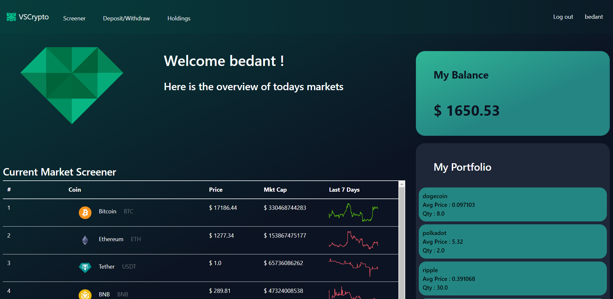
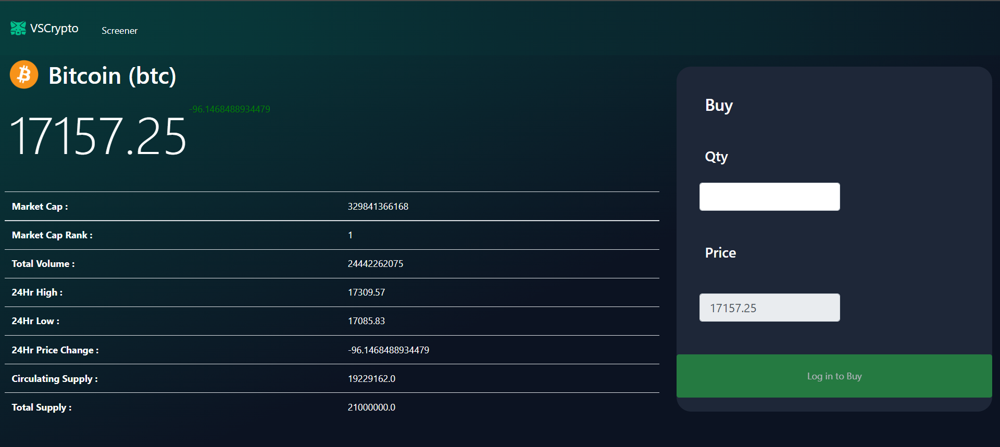

# **Cryptocurrency Trading Application**
#### Technique : Using CoinGecko API for getting live cryptocurrency data from the markets + Django for server side +Javascript for dynamically updating prices




#### Video representation of the final product - cryptocurrency trading application
[](https://youtu.be/XhG0Ho6lGd0)

## Installation
#### No extra libraries are needed to run this project beyond Python version 3.

## How to Run this Application
#### run the project using 
```
python manage.py runserver
```

## External API's Used
#### CoinGecko API is used in this project to fetch real time cryptocurrency prices. Also, coins can be bought and sold to make profits according to the real time markets.
CoinGecko API (https://www.coingecko.com/en/api/documentation)

## Project Details
#### Cryptocurrency trading application is used to buy currency virtually and sell it as investments or to make trades. The coins bought in the application are stored in Coin model. One user can buy and own many coins and can sell them anytime. The final balance the user has can be withdrawn or credited anytime as per the will of the user. The project can be further expanded to implement many other functions in future.

## Distinctiveness
#### This project stand out from other projects because here the focus in on user transactions and tracking prices, dynamically updating prices and fetching them dynamically using the Coingecko API. The dynamically updating prices for ech coin was important as without it the pages would have looked static. Also while tranacting the users balance was also to be considered, if the user didn't have adequate funds then he shouldn't be allowed to buy. Also the page should be mobile responsive, so Bootstrap was used.

## Complexity
#### The complex part of this project was to change the prices dynamically and catch the spot price and execute the transactions at that price. As you can see that this type of dynamically changing data can lead to errors. So the important part was to keep the price updating at certain intervals and execute transaction at that price.